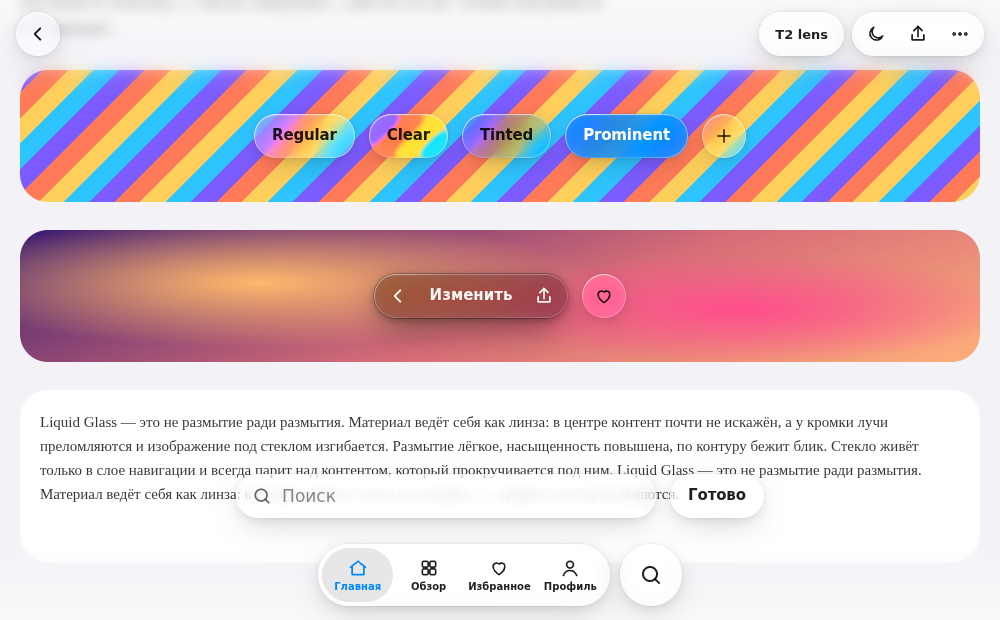
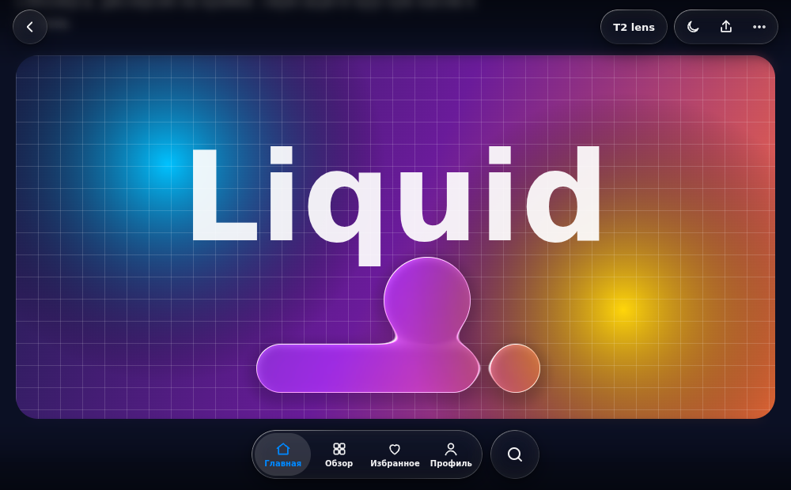

# Liquid Glass для ИИ-агентов

Набор инструкций, токенов и эталонного кода, по которому ИИ-агенты (Claude Code, Cursor, GitHub Copilot, Codex, Gemini CLI и другие) делают интерфейсы в стиле **Liquid Glass** — как в Apple iOS / macOS 26–27 — на любой платформе: Web, Windows, Android, Flutter, Apple, кроссплатформенные фреймворки и игровые движки. Цель — максимальная похожесть на оригинал без просадок производительности, включая «жидкие» анимации.

**Агентам:** начинайте с [AGENTS.md](AGENTS.md).

| Материал: regular / clear / tinted / prominent, рефракция кромки (T2) | Шейдерное стекло (T3): капли сливаются |
|---|---|
|  |  |

*Скриншоты эталонной веб-реализации (`reference/web/demo.html`) в Chromium.*

## Что внутри

```
AGENTS.md                      точка входа для агентов: алгоритм, маршрут по стекам, золотые правила
docs/
  01-principles.md             что такое Liquid Glass, анатомия материала, иерархия, варианты
  02-tokens.md                 все числа: материал, блик, тени, рефракция, геометрия, типографика, пружины
  03-optics.md                 математика: SDF, преломление по Снеллиусу, карта смещений, блик, слияние капель
  04-components.md             кнопки, тулбары, таб-бар, сегменты, переключатели, меню, sheets, sidebar…
  05-motion.md                 «жидкие» анимации: пружины, набухание, «желе», капля-индикатор, морфинг, слияние
  06-performance.md            уровни качества T0–T3, бюджеты, ловушки платформ, профилирование
  07-accessibility.md          Reduce Transparency / Motion, контраст, forced colors, клавиатура
  08-checklist.md              Definition of Done, анти-паттерны, шаблон отчёта
platforms/
  apple.md                     SwiftUI / UIKit / AppKit — нативный Liquid Glass (26+) и backport
  web.md                       CSS/JS, React, Next, Vue, Nuxt, Svelte, Angular, Tailwind, Lit, WebGL, Electron, Tauri
  windows.md                   WinUI 3, UWP, WPF, WinForms, Avalonia, Uno, Win32
  android.md                   Jetpack Compose (GraphicsLayer + AGSL, Haze), Views, Compose Multiplatform
  flutter.md                   Flutter на всех платформах, Impeller-шейдер
  cross-platform.md            React Native / Expo, .NET MAUI, Qt / QML, Linux, Unity, Unreal, Godot
tokens/liquid-glass.tokens.json   токены в формате W3C Design Tokens (Style Dictionary v4)
reference/
  web/                         эталонная веб-реализация + демо (проверена в Chromium)
  shaders/                     GLSL (WebGL), AGSL/SkSL (Android, Skia), Flutter, HLSL (WPF), Godot
tools/
  spring.mjs                   пересчёт пружин под любой стек (SwiftUI, Compose, WinUI, Flutter, CSS…)
  visual-check.mjs             скриншоты по матрице тем/доступности + замер кадров (Playwright)
  check.mjs                    проверка согласованности репозитория
```

## Как подключить к своему проекту

**Вариант 1 — подмодуль** (агент видит файлы локально):

```bash
git submodule add https://github.com/moz9/liquidglass design/liquidglass
```

и добавьте в инструкции агента вашего проекта (`AGENTS.md`, `CLAUDE.md`, `.cursor/rules/…`, `.github/copilot-instructions.md`):

```md
## UI
Интерфейс делаем в стиле Liquid Glass. Перед любой работой с UI прочитай
design/liquidglass/AGENTS.md и следуй ему (пути в нём — относительно design/liquidglass/).
```

- **Claude Code:** в `CLAUDE.md` проекта можно импортировать файл напрямую: `@design/liquidglass/AGENTS.md`. Навык из `.claude/skills/liquid-glass/` можно скопировать в `.claude/skills/` проекта.
- **Cursor:** скопируйте `.cursor/rules/liquid-glass.mdc` в `.cursor/rules/` проекта и поправьте пути.
- **GitHub Copilot:** добавьте абзац выше в `.github/copilot-instructions.md` проекта.

**Вариант 2 — ссылкой.** Агенту с доступом в интернет достаточно написать: «Сделай UI в стиле Liquid Glass по инструкциям https://github.com/moz9/liquidglass — начни с AGENTS.md».

**Примеры запросов агенту:**
- «Сделай нижний таб-бар и верхний тулбар в стиле Liquid Glass для нашего Next.js-приложения».
- «Переведи главное окно WinUI 3 на Liquid Glass: плавающий тулбар, меню с морфингом, пружинные анимации».
- «Добавь в Compose-приложение стеклянные кнопки с рефракцией на Android 13+ и fallback для старых версий».

## Демо

```bash
npx http-server .          # в корне репозитория
# открыть http://localhost:8080/reference/web/demo.html
# параметры: ?tier=0|1|2  ?theme=light|dark
```

Рефракция (T2) видна в Chromium-браузерах (Chrome, Edge, Opera); Safari и Firefox показывают T1. В демо: варианты материала, капля-индикатор (можно тянуть), бегунок-линза в переключателе, меню, вытекающее из кнопки, адаптивная светлость баров и WebGL-слияние капель.

## Важно

- Liquid Glass — дизайн-язык Apple. Проект не связан с Apple; значения для не-Apple платформ — откалиброванные приближения, а на iOS/macOS 26+ инструкции требуют использовать нативный материал.
- Шрифты SF Pro и иконки SF Symbols лицензированы только для Apple-платформ — инструкции запрещают встраивать их в Android/Windows/web-сборки.
- API платформ в инструкциях соответствуют актуальным на момент написания SDK; агенты обязаны сверяться с установленными версиями и не выдумывать сигнатуры.
